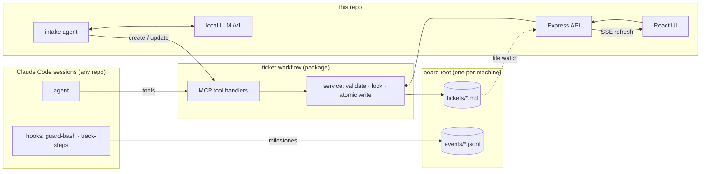

# Kanban — an agent-driven ticket board

A kanban board where **every ticket is one Markdown file**, driven by an AI agent through an
[MCP](https://modelcontextprotocol.io) server. One board serves several repos on the same machine.
Claude Code picks a ticket, cuts the branch, ships the PR, and the board's status stays true while
it happens — a session hook records each pipeline milestone as the command that produced it runs.

The board is both the product and its own issue tracker: it was built by an agent working through
its own tools, one ticket → one branch → one squash-merged PR, gated by CI, with a human at four
checkpoints. As of 2026-09-08: **378 commits, 346 co-authored by Claude, across 45 active days**
(generated by `scripts/probe/repo-stats.mjs`, never hand-counted).

The ticket engine is a separate open-source package, [`ticket-workflow`](https://github.com/mcinerneyjake/ticket-workflow)
(MIT) — MCP server, guard and telemetry hooks, and a pipeline CLI — consumed here by pinned tag and
installed in five repos, this one included, plus the machine-wide Claude Code config. This repo is
the reference UI on top of it.

Case study, with annotated traces from real runs:
[jakemcinerney.dev/case-studies/ai-native-workflow](https://jakemcinerney.dev/case-studies/ai-native-workflow/).

## How it fits together



Two edges, one service. The MCP server and the Express API both call the same package service,
so ticket validation, locking and atomic writes live in one place. Hooks append pipeline events
(`branch`, `commit`, `pr_opened`, …) as they happen, and the UI reads them back per ticket.

## Run it

Node 24+ (`.nvmrc` pins it — `nvm use`).

```bash
npm install
npm run seed     # seeds a demo board; no-op if tickets/ already has files
npm run dev      # API on :3001, UI on :5173
```

Open <http://localhost:5173>. **No LLM, key or `.env` is needed for the board or the MCP server.**
Only the intake agent's drafting and dedup need a local model; without one the create modal falls
back to a plain form.

`npm run dev` first runs an advisory preflight that offers to start Docker and LM Studio when they
are installed; answer `n`, or set `KANBAN_NO_PREFLIGHT=1` to skip the prompts. Without Docker the
embedded terminal logs a failed `docker ps` and everything else works.

## A five-minute tour

- **The seam every write crosses** — `server/tickets.ts` and `mcp/handlers.ts` are named re-exports
  from the package. The comment at the top says why not `export *`.
- **The shape of a write** — in the package, `updateTicket` reads under a per-id lock, snapshots the
  prior body to `.history/`, and writes temp-then-rename.
- **The round-trip test** — `src/lib/intakeRoundTrip.test.ts` drives a fake chat client through
  the real intake chain into a real `createTicket` and asserts the persisted ticket equals the
  proposal.
- **The type-parity test** — `shared/constants.test.ts` pins this repo's domain types to the
  package's with `expectTypeOf`, and its comment records the release that got past the wire.
- **A probe that proves its instrument** — `scripts/probe/repo-stats.mjs` runs a positive and
  negative control before it will report a number.
- **The gates** — `.claude/hooks/guard-bash.mjs` blocks the dangerous git shapes and fails closed
  when it cannot tell which branch it is on; `.claude/settings.audit.test.mjs` is the executable
  record of the permission model.

## Three decisions, with their costs

**Markdown files are the database.** A ticket is readable and editable in any tool, diffs are
plain text, and there is nothing to install. The cost: every list is a directory scan plus a
frontmatter parse — a full scan of the live board, 1,445 tickets, measured 130–290 ms on
2026-09-08 — and the write lock is in-process only, which is the first item under
[What's next](#whats-next).

**The intake agent is local-first and runs air-gapped.** An OpenAI-compatible `/v1` endpoint is the
whole provider contract; cloud is a config swap, not a code path. Cost is measured from energy
(kWh × your regional rate), not estimated from token prices. The cost: a local model's
tool-calling is less reliable, so the loop is bounded (step cap, per-request timeout, create cap)
and every write pauses for a human.

**No state library in the UI.** One data source, an optimistic move with a short mute on the
file-watcher echo, and every derivation is a pure function in `src/lib/` with its own test. The
cost: the board component carries every mutation handler, and props go three levels deep.

## Use it as an MCP server

`.mcp.json` wires the server at project scope; Claude Code asks you to trust it on first load.
Tools: `list_tickets`, `get_ticket`, `start_ticket`, `create_ticket`, `update_ticket`,
`record_review`, `archive_ticket`, `delete_ticket`.

To serve one board from every repo on a machine, install `ticket-workflow` at user scope and set
`BOARD_DIR_OVERRIDE` to this checkout in the environment of that MCP server and of the
`track-steps` hook; the package resolves its board root from that variable ahead of the project
directory and the working directory.

## Intake agent (local RAG)

Turns a raw report into the right action on the board — update the existing ticket or create a
new one — with a human approving every write.

```bash
npm run agent -- "the PDF export cuts off the footer on mobile Safari"
```

Four layers, each tested with the model mocked: retrieval (embeds every ticket, in-memory cosine
index), tools (an allowlist of the MCP tools plus `search_board`), the tool-use loop, and the CLI
approval gate, where a closed stdin means *decline*. `npm run eval:retrieval` scores the index
against a golden set (recall@1, recall@5, MRR) and refuses to report a number until a positive and
a negative control pass. Setup is under [Local-LLM setup](#local-llm-setup).

## Embedded terminal (dev-only)

With `KANBAN_TERMINAL=1` (the default under `npm run dev`) a ticket can open a Claude Code session
in a Docker container from the board, over a websocket, with the checkout bind-mounted and a
GitHub token scoped to one repo. Pushing and opening the PR happen in the container; merging stays
a human step by convention, and branch protection holds the PR and the green gate. The terminal is
a loopback dev tool and is not hardened beyond that; see [What's next](#whats-next).

## Tests & CI

```bash
npm run typecheck
npm run lint
npm test            # vitest, every logic layer
npm run test:e2e    # playwright, real browser against a temp board
```

A husky pre-commit hook runs the first three. On every PR into `main`, GitHub Actions runs those
plus per-layer coverage thresholds, the Vite build and the `ticket-workflow` guardrail audit as one
`gate` check, alongside a branch-name check; branch protection requires both checks. A path-filtered Playwright job runs on
UI-facing changes and is advisory. An automated Claude code-review workflow exists and is
**disabled**: it needs an API key and fails closed without one, and a disabled workflow contributes
no check at all, so the PR reads all-green — `gh workflow list --all` is the only place it shows.

The e2e suite is deterministic without a model: `playwright.config.ts` pins the drafting model at a
dead port so the create modal always falls back to the manual form.

## Layout

```
kanban/
├── server/          Express API: routes → controllers → package service (shims in tickets.ts, events.ts)
├── mcp/             stdio entrypoint for the package's MCP handlers
├── agent/           intake agent: retrieval · runtime · cost · eval · replay
├── shared/          domain types, pinned to the package by a parity test; dev ports
├── src/             React app; src/lib/ is the tested pure layer
├── e2e/             Playwright
├── scripts/probe/   probes with built-in controls (repo stats, adoption markers, …)
├── .claude/         hooks, settings, and the audit test that pins them
├── tickets/         the board (gitignored) — one .md per ticket, .history/ snapshots
└── events/          pipeline milestones (gitignored) — one .jsonl per ticket
```

## Ticket format

```markdown
---
title: SSO login fails on Safari
type: bug           # bug | feature | task | chore
priority: high      # low | medium | high | urgent
status: in-progress # backlog | todo | in-progress | qa | done | archived
order: 1            # fractional sort key within a column
project: kanban
created: 2026-06-20T09:00:00.000Z
updated: 2026-06-20T09:00:00.000Z
---

## Description
Markdown body…
```

Optional: `blockers`, `parent`, `dueDate`, `assignee`, `source`, `runId`. Filenames are `{id}.md`,
never title-derived, so a rename moves nothing. Dropping a card between two others sets its
`order` to the midpoint, so a move rewrites one file. A hand-edited file never crashes the board:
an invalid `type`, `priority` or `status` value falls back to its default silently, and a file
whose frontmatter will not parse is skipped and reported in the API's `unreadable` list rather
than counted.

## What's next

Ranked by consequence.

1. Cross-process write lock in the package — the only silent data-loss path today.
2. Publish `ticket-workflow` to npm so consumers stop compiling it on install.
3. Harden the terminal container (non-root, cap-drop, pinned install) or extract it.
4. Index the ticket directory instead of scanning it per operation.

## Known limits

No auth. The API binds to loopback and checks the `Host` header, and that is the whole access
control — do not expose it to a network as-is. There is no rate limiting, and the Markdown preview
is sanitized client-side with DOMPurify only. One board per machine, one user.

<details>
<summary><h2>Local-LLM setup</h2></summary>

Copy `.env.example` to `.env` and set an embedding model and a chat model. The IDs **must match
what your runtime advertises** — check with
`node -e "fetch('http://localhost:1234/v1/models').then(r=>r.text()).then(console.log)"` (`curl` is denied by
`.claude/settings.json`, so it cannot be approved at a prompt):

```bash
EMBED_BASE_URL=http://localhost:1234/v1
EMBED_MODEL=text-embedding-qwen3-embedding-0.6b
LLM_BASE_URL=http://localhost:1234/v1
LLM_MODEL=openai/gpt-oss-20b
```

Any OpenAI-compatible runtime works (LM Studio, llama.cpp, Ollama). The chat model needs reliable
tool-calling. Open-weight options, in rough quality order:

| Model | Notes |
|---|---|
| `qwen3-coder-30b-a3b` | Best tool-calling + summaries |
| `openai/gpt-oss-20b` | Great on ~16 GB |
| `qwen3.5-9b` | Lightest; summaries can be thin |

Task-instruction prefixes for known embedders (Qwen3-Embedding, nomic) are applied automatically;
override with `EMBED_QUERY_PREFIX` / `EMBED_DOC_PREFIX`. The chat model defaults to
`temperature: 0` because intake is a classification task; override via `LLM_TEMPERATURE`,
`LLM_TOP_P`, `LLM_SEED`, and `LLM_REASONING_EFFORT` (`low`/`medium`/`high` — an accuracy dial,
roughly 6× slower at `high`).

**Quick path:** install [LM Studio](https://lmstudio.ai), load Qwen3-Embedding-0.6B plus a chat
model from the table, start the server on `:1234`, put the exact IDs in `.env`, then `npm run dev`
and hit **+ New ticket** — paste a messy note and the agent drafts the ticket, with a related-tickets
dedup strip as you type.

**Bring your own key (optional):** the seam is the `/v1` contract, so `LLM_BASE_URL` can point at a
cloud endpoint with `LLM_API_KEY` in `.env` (OpenAI works natively). A dedicated Anthropic driver
was evaluated and deliberately dropped rather than shipped half-verified. The embedder is keyless,
so retrieval still runs against a local embedding model either way.

</details>

<details>
<summary><h2>GitHub from the embedded terminal</h2></summary>

One-time setup for pushing and opening PRs from inside the container:

1. Create a GitHub **fine-grained PAT** scoped to only this repo, with **Contents: Read and write**
   and **Pull requests: Read and write** — nothing else, and an expiry.
2. Seed it. The token is read hidden and written outside the repo, never to git or the
   `docker run` argv:
   ```bash
   node scripts/terminal-setup-github.mjs --user <your-github-username>
   # or:  printf '%s' "$PAT" | node scripts/terminal-setup-github.mjs --user <you>
   ```
3. Open a terminal session and confirm with `gh auth status`, then a throwaway push and PR.

The token lives in a `0600` file inside the container's mounted HOME, outside every project
mount. Remotes are rewritten to HTTPS so no SSH host key is trusted. Merge authority is as
described under [Embedded terminal](#embedded-terminal-dev-only). Revoke the PAT if it is ever
exposed on screen.

</details>
